# ExamStore

Previous-year question papers in one place. **Students** search, preview and download papers, and can send in papers that are missing; **admins** upload, review and manage them. Both sides live in one web app, and the role on your account decides what you see.

**Live site:** https://examstore.onrender.com

> Hosted on Render's free plan: after 15 minutes without visitors the site sleeps, so the first visit can take 30–60 seconds to load.

## Screenshots

*Shown with sample data.*

### For students

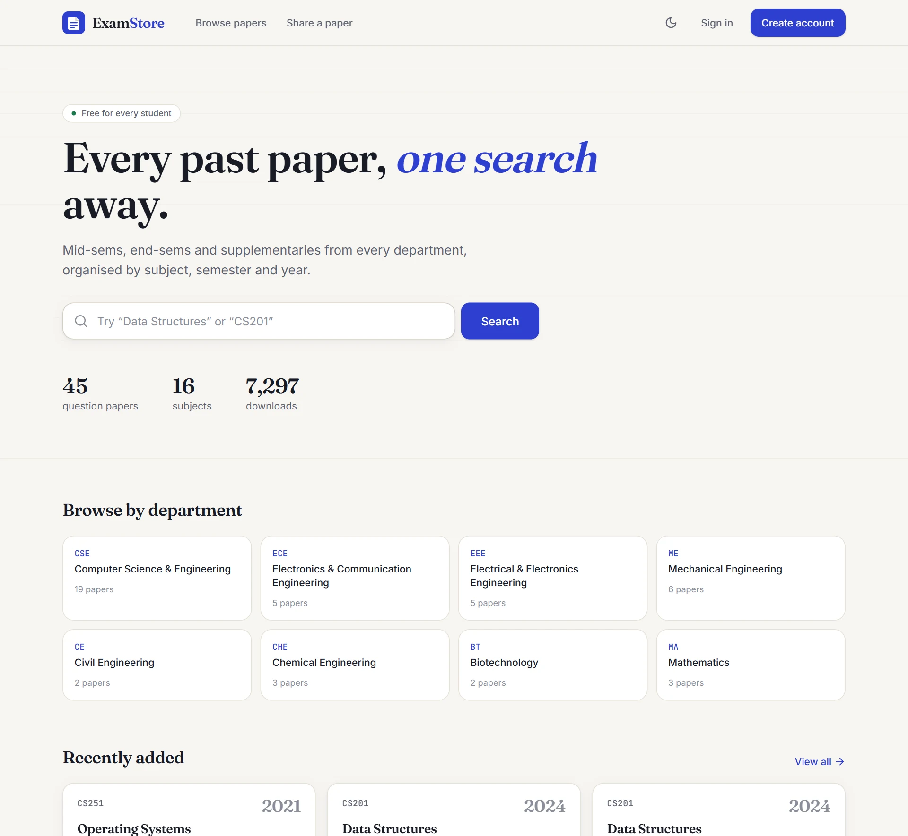

| Browse and filter | Read a paper in the browser |
|---|---|
| 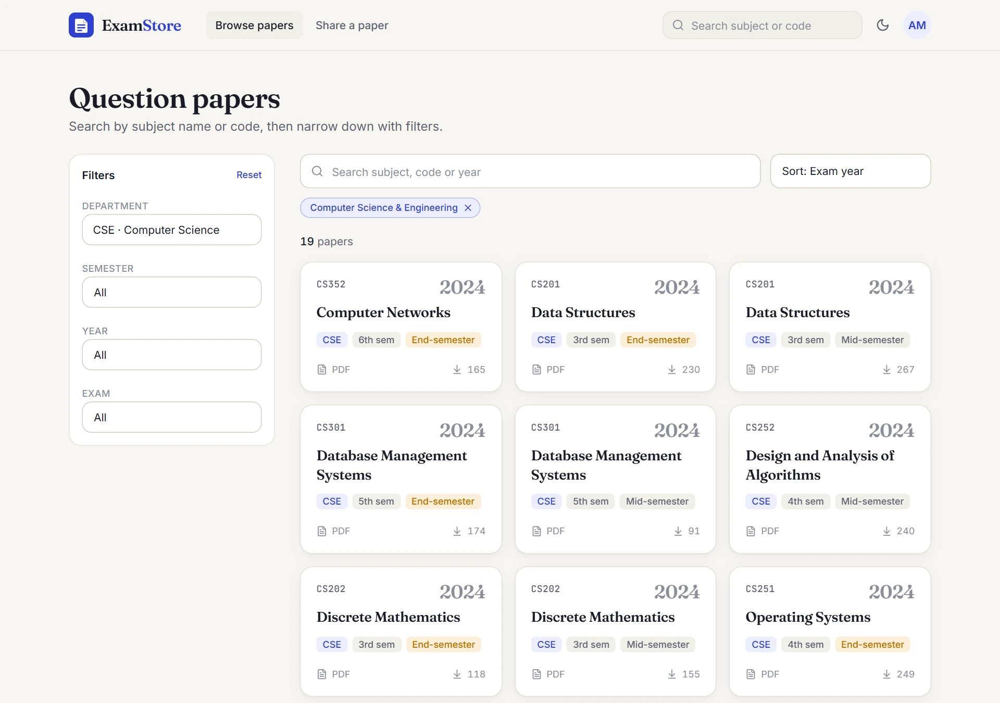 | 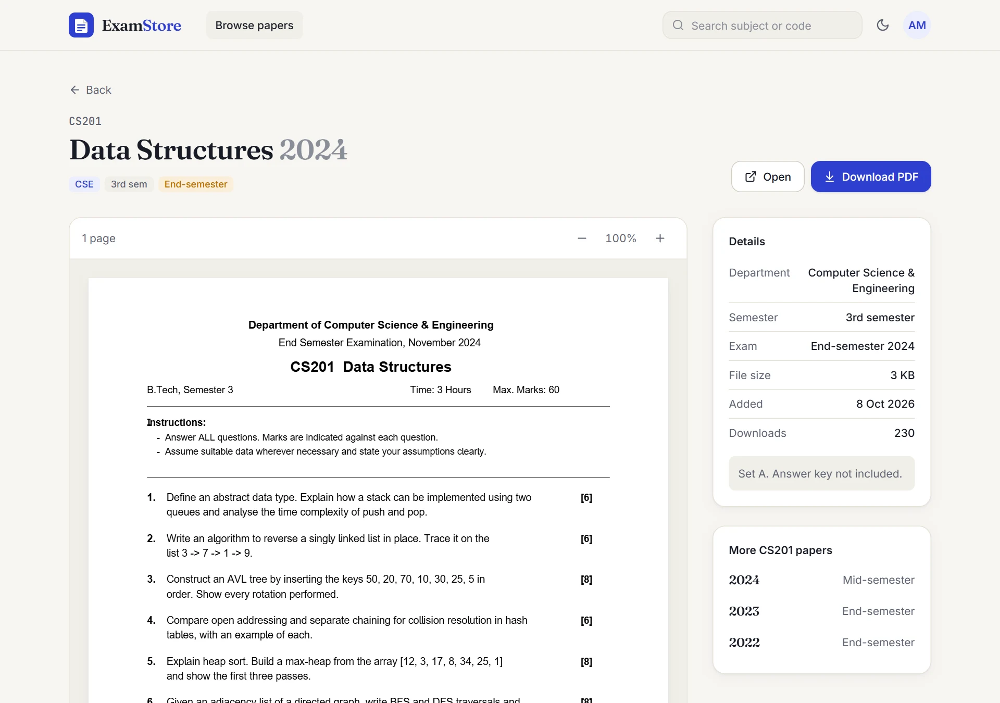 |

**Share a missing paper** and follow its status (waiting, published, or not accepted with the reason):

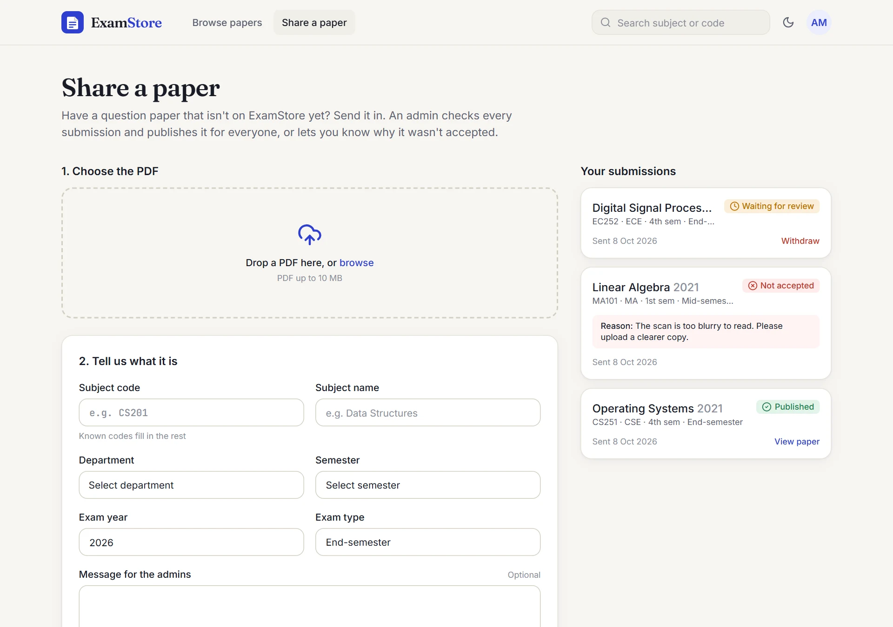

### For admins

| Dashboard | Upload a paper |
|---|---|
| 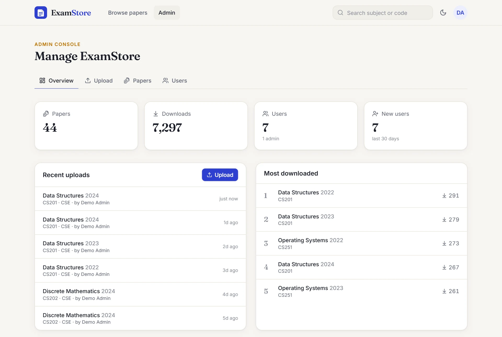 | 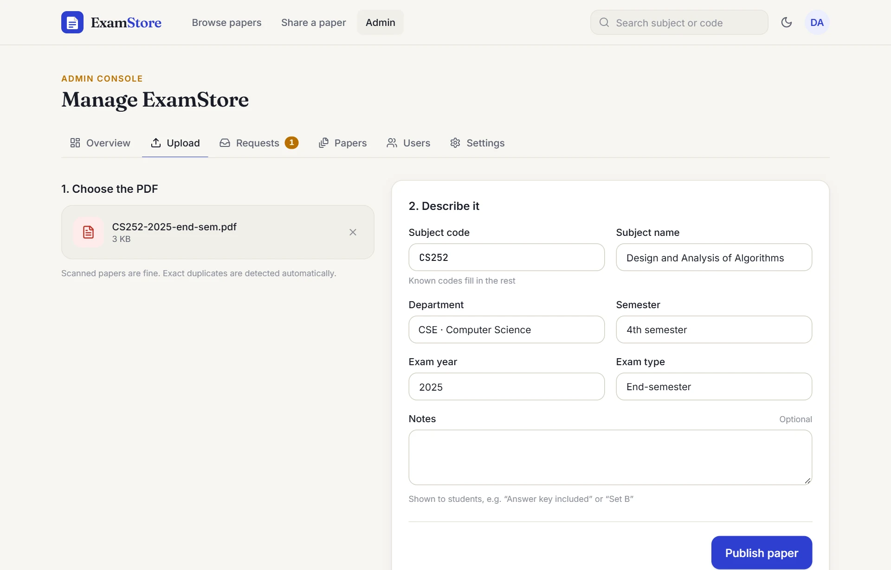 |

**Review a student's request**: the PDF beside its details, ready to correct and publish, or reject:

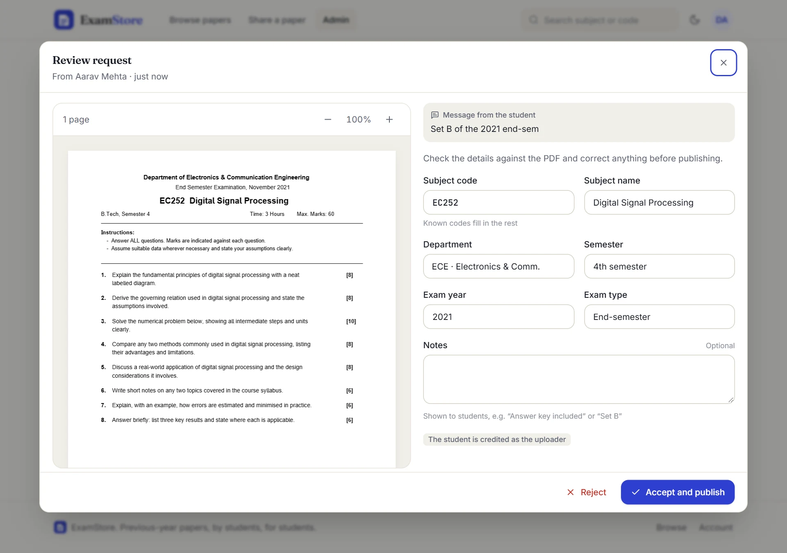

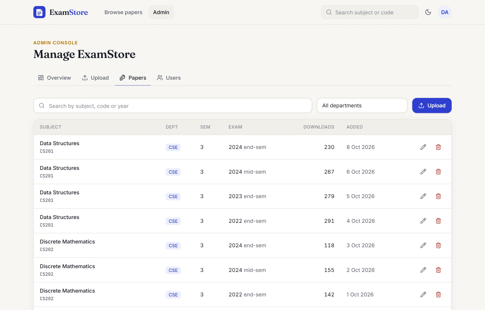

### Dark mode and mobile

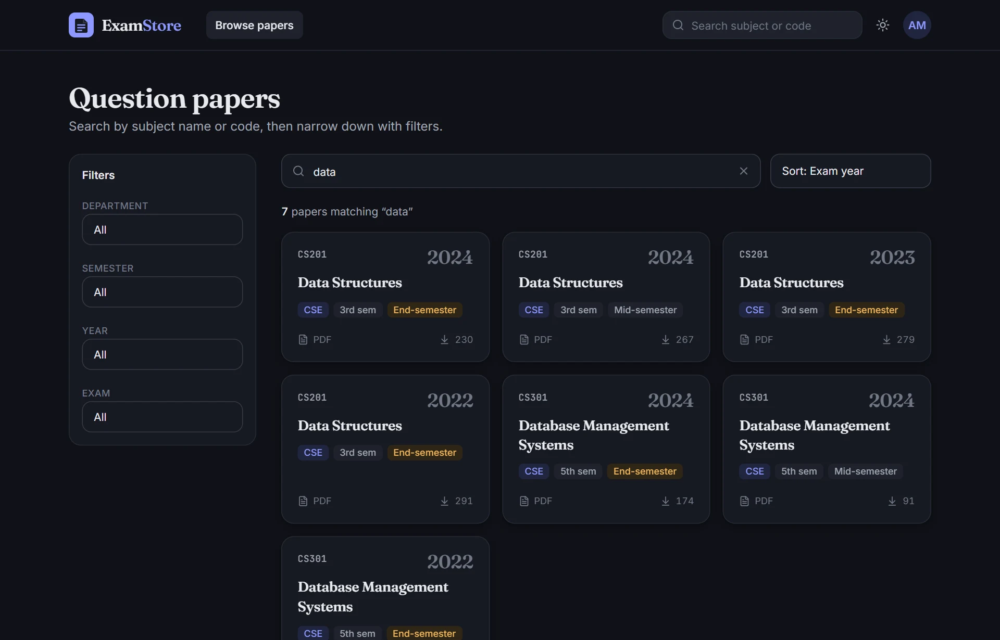

<p align="center">
  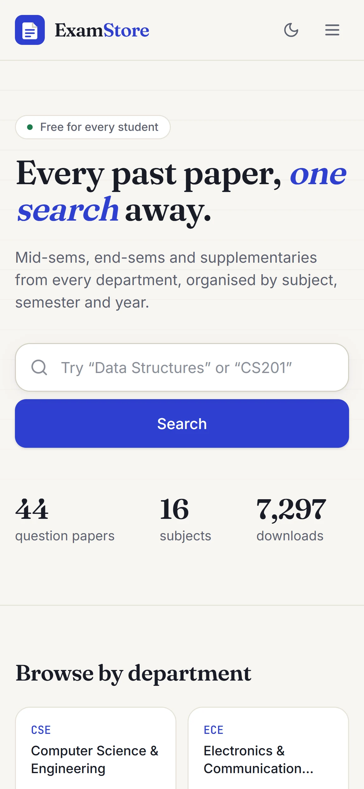
  &nbsp;&nbsp;
  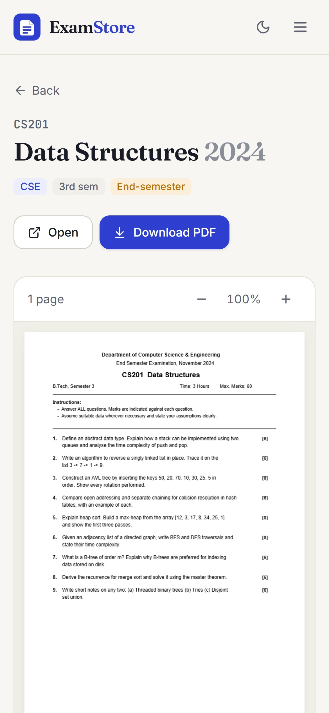
</p>

## Quick start

Requires Node.js 20+.

```bash
npm install
npm run dev
```

Open http://localhost:5173. (In development, port 5000 is only the API; visiting it redirects to 5173.)

- With no `MONGODB_URI` set, the backend starts a local MongoDB automatically and keeps its data in `backend/.data/`. **The first run downloads MongoDB (~600 MB on Windows)**, which takes a few minutes once. To skip that, set `MONGODB_URI` in `backend/.env` to a local MongoDB or a free [MongoDB Atlas](https://www.mongodb.com/atlas) cluster.
- Uploaded PDFs are stored in `backend/uploads/` (or Cloudinary, see [Deploying](#deploying)).
- Sign-up asks for a 6-digit email code. Without Brevo configured, the code is printed in the `npm run dev` terminal. Admins can switch verification off in **Admin → Settings** while testing.

## Becoming an admin

Any of these works:

1. Put the email in `ADMIN_EMAILS` in `backend/.env` (comma-separated). That account becomes admin when it signs up or logs in.
2. Promote an existing account from the terminal:
   ```bash
   npm run make-admin -- someone@student.nitw.ac.in
   npm run make-admin -- someone@student.nitw.ac.in --revoke
   ```
3. An existing admin can use **Admin → Users → Make admin**.

## What's inside

| | Students | Admins |
|---|---|---|
| Browse and search by subject, code or year | ✓ (no sign-in needed) | ✓ |
| Filter by department, semester, year, exam type | ✓ | ✓ |
| Preview PDF in the browser and download | ✓ (signed in) | ✓ |
| Send in a missing paper for review, and follow its status | ✓ (signed in) | ✓ |
| Upload papers (drag and drop, subject autocomplete, duplicate detection) | | ✓ |
| Review student requests: preview, correct details, accept and publish, or reject with a reason | | ✓ |
| Edit details, replace the PDF, delete | | ✓ |
| Dashboard (papers, downloads, users, most downloaded, waiting requests) | | ✓ |
| Grant or revoke admin access | | ✓ |
| Switch email verification at sign-up on or off | | ✓ |

Only emails on `ALLOWED_EMAIL_DOMAINS` (default `student.nitw.ac.in`) can sign up, except those listed in `ADMIN_EMAILS`. While email verification is on, new accounts confirm their address with a 6-digit code (10-minute expiry, 5 tries, resend after 60 seconds).

## Project layout

```
backend/            Express 5 + Mongoose API
  src/config/       env loading, catalogue (departments, exam types)
  src/models/       User, Paper, PaperRequest, PendingSignup, Setting
  src/routes/       auth, papers, requests, admin, meta
  src/lib/          db (with local fallback), storage (local disk / Cloudinary),
                    papers (shared validation + PDF streaming), mail (Brevo), settings
  src/scripts/      make-admin
frontend/           React 19 + Vite + Tailwind CSS 4
  src/pages/        Home, Browse, PaperDetail, Auth (sign-up + code), Account,
                    Contribute (share a paper), admin/* (Overview, Upload, Requests,
                    Papers, Users, Settings)
  src/components/   Header, Layout, PaperCard, PdfViewer (PDF.js), RequestStatus, ui primitives
  src/store/        auth + catalogue state (zustand)
```

To add a department or exam type, edit `backend/src/config/catalog.js`. The UI picks it up automatically.

## API

| Method | Path | Access |
|---|---|---|
| POST | `/api/auth/signup` (emails a code, or signs up straight away when verification is off) | public |
| POST | `/api/auth/signup/verify`, `/api/auth/signup/resend` | public |
| POST | `/api/auth/login`, `/api/auth/logout` | public |
| GET / PATCH | `/api/auth/me` · POST `/api/auth/me/password` | signed in |
| GET | `/api/meta` (departments, years, stats), `/api/meta/subjects` (autocomplete) | public |
| GET | `/api/papers?q&department&semester&year&examType&sort&page` | public |
| GET | `/api/papers/:id` | public |
| GET | `/api/papers/:id/file[?download=1]` | signed in |
| POST / PATCH / DELETE | `/api/papers[/:id]` (multipart field `file`) | admin |
| POST | `/api/requests` (multipart: `file` + paper details + optional `message`) | signed in |
| GET / DELETE | `/api/requests/mine`, `/api/requests/:id` (withdraw while pending) | signed in |
| GET | `/api/requests/:id/file` | submitter or admin |
| GET | `/api/requests?status=pending|approved|rejected` | admin |
| POST | `/api/requests/:id/approve` (body may correct details), `/api/requests/:id/reject` | admin |
| GET | `/api/admin/stats`, `/api/admin/users` | admin |
| PATCH | `/api/admin/users/:id/role` | admin |
| GET / PATCH | `/api/admin/settings` (email verification switch) | admin |

## Deploying

The backend serves the built frontend, so production is one service on one port:

```bash
npm install
npm run build
NODE_ENV=production npm start
```

Set these environment variables on your host (Render, Railway, a VPS, …):

- `MONGODB_URI`: required in production
- `JWT_SECRET`: required; a long random string
- `ADMIN_EMAILS`, `ALLOWED_EMAIL_DOMAINS`: as above
- `STORAGE_DRIVER=cloudinary` plus the `CLOUDINARY_*` keys: PDFs are stored as private files in Cloudinary, since most hosts' disks aren't persistent. Students never get a direct Cloudinary link; files are streamed through the backend after the sign-in check. Each paper remembers where its file is stored, so switching drivers later is safe.
- `BREVO_API_KEY` and `MAIL_FROM` (optional): email sign-up codes through [Brevo](https://www.brevo.com)'s HTTPS API (free for 300 emails a day). Render's free plan blocks SMTP, so an HTTP email API is required there. `MAIL_FROM` must be a sender verified in Brevo; the server checks this at startup. Without these, production sign-up works without a code.

See `backend/.env.example` for every option.
